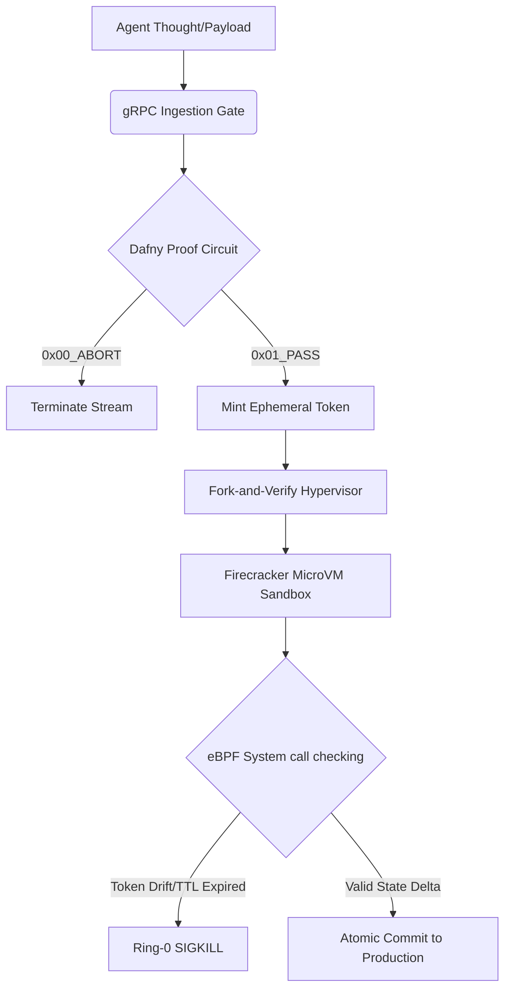

# Core System Architecture Reference

SecOps Kernel wraps the autonomous AI agent execution lifecycle inside an un-bypassable hardware and memory virtualization boundary.

## The Verification Lifecycle

## Isolation Boundary Frameworks
* **Firecracker MicroVMs**: Every agent payload runs inside an isolated guest state mirror with a strict 512MB memory boundary and a **500ms execution timeout window**.
* **eBPF System call hooks**: Attaches directly onto the host's `sys_enter_execve` array table, checking permission blocks dynamically at Ring 0 out-of-band.
