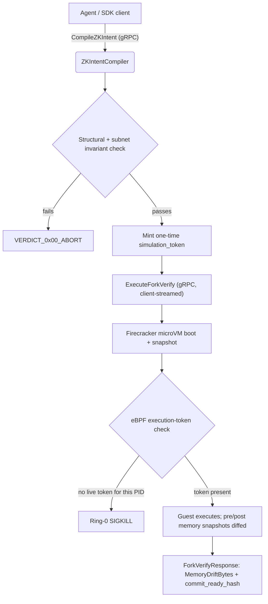

# Core System Architecture Reference

SecOps Kernel gates an autonomous agent's proposed infrastructure actions
behind a gRPC compiler, a set of invariant checks, and a Firecracker
microVM replay, backstopped by an eBPF execution-token check at the
syscall level.

## The Request Lifecycle

What each stage actually does today:

* **ZKIntentCompiler.CompileZKIntent** (`pkg/server/compiler.go`) runs
  `pkg/server.CheckGraph`: first structural validation
  (`ValidateGraphStructure` — unique node IDs, no dangling edges, no
  cycles, `SYS_CALL_*` directive namespace, bounded payload size), then
  the write-privilege/subnet invariant that mirrors
  `pkg/verify/dafny/intent_rules.dfy` (`subnet ∈ [1000, 9999]` for any
  write-privileged node). A pass mints a one-time-redeemable
  `simulation_token`.
* **ForkVerifyEngine.ExecuteForkVerify** (`pkg/server/forkverify.go`)
  redeems that token and calls `Orchestrator.SpawnAndMeasure`
  (`pkg/sandbox/firecracker`), which boots a Firecracker guest over its
  real REST API (boot-source/drives/machine-config/actions). While the
  guest is paused (so no further writes can race the copy), it takes a
  memory snapshot and a copy of the rootfs image just after boot, and
  another pair partway through the execution window, returning real
  diffs as `MemoryDriftBytes` (byte-level) and `FilesMutated` (regular
  files added/removed/changed, read from the ext4 image directly via
  `debugfs` — no loopback mount or root required; see
  `pkg/sandbox/firecracker/rootfsdiff.go`). `NetworkPacketsDropped` is
  **not** measured — the orchestrator never configures a network
  interface for the guest at all, so there's nothing to count yet.
* **eBPF enforcement** (`pkg/kernel/ebpf/monitor.c` +
  `pkg/kernel/ebpftoken`): the orchestrator starts its child process
  under `PTRACE_TRACEME` and grants it a token in `active_tokens_map`
  during the kernel-guaranteed stop-at-exec trap, before the eBPF hook's
  first `sys_enter_execve` check can fire. Any process without a live
  token is `SIGKILL`'d. `kernel-server` refuses to start without a
  working token controller unless run with `-enforce-ebpf=false`.
* **BFT consensus** (`pkg/consensus`) is a separate component from the
  request lifecycle above, used for high-impact actions that require
  multi-agent agreement: proposals are keyed by a verified `AgentID`
  (not by claimed model architecture), checked against a registered
  ed25519 public key, and quorum requires both enough distinct signed
  agents and enough distinct model architectures agreeing on the same
  state-diff hash.

What's still aspirational: an actual "commit to production" step (the
gRPC path proves a hash is ready to commit; nothing applies it to real
infrastructure), and Dafny verification at request time rather than as a
hand-kept-in-sync Go re-implementation (`dafny verify` still only runs as
a static CI check on `intent_rules.dfy` itself). See
[`IMPROVEMENT_SPEC.md`](https://github.com/asfour/secops-ai-kernel/blob/main/IMPROVEMENT_SPEC.md)
at the repository root for the full, current gap list.

## Isolation Boundary Frameworks
* **Firecracker MicroVMs**: memory limit defaults from
  `configs/secops-kernel.yaml`'s `engine.memory_fence_bytes` (see
  `pkg/config`); the execution timeout comes from the request's
  `max_allowed_latency_ms`, capped by `engine.max_execution_window_ms`.
  The post-execution memory snapshot is taken at half of that timeout to
  avoid racing the orchestrator's own background process-kill goroutine.
* **eBPF System call hooks**: attach to the host's `sys_enter_execve`
  tracepoint; a process is killed the instant it has no live, unexpired
  entry in `active_tokens_map`.
