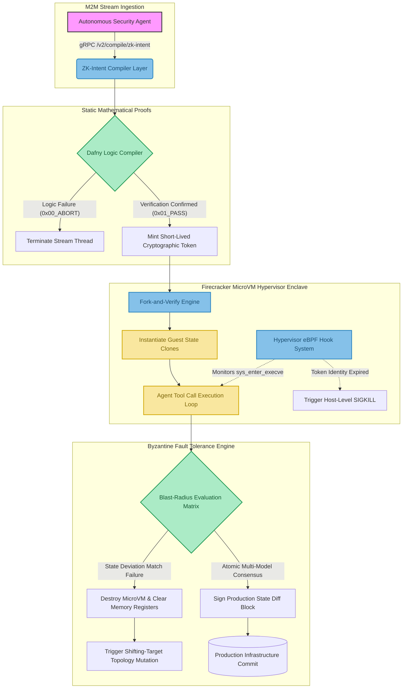

# SecOps Kernel v2.0 Execution Blueprint

> **Vision / marketing document.** Describes target behavior, not what is currently implemented or benchmarked — specific numbers below (timings, throughput) are illustrative, not measured. For the actual current state of the code, see [docs/improvement_spec.md](../improvement_spec.md).

This diagram maps out the machine-to-machine isolation engine of the SecOps Kernel infrastructure.

## Protocol Execution Cycle Timeline
1. **Time T+00.0ms**: Agent sends structured payload graph to endpoint.
2. **Time T+12.0ms**: Dafny compiler asserts invariant protection logic.
3. **Time T+15.0ms**: Firecracker microVM isolates target node snapshot vectors.
4. **Time T+22.0ms**: eBPF verification map handles runtime tool call tracking out-of-band.
5. **Time T+35.0ms**: Atomic state diff is securely written to production database layers.
